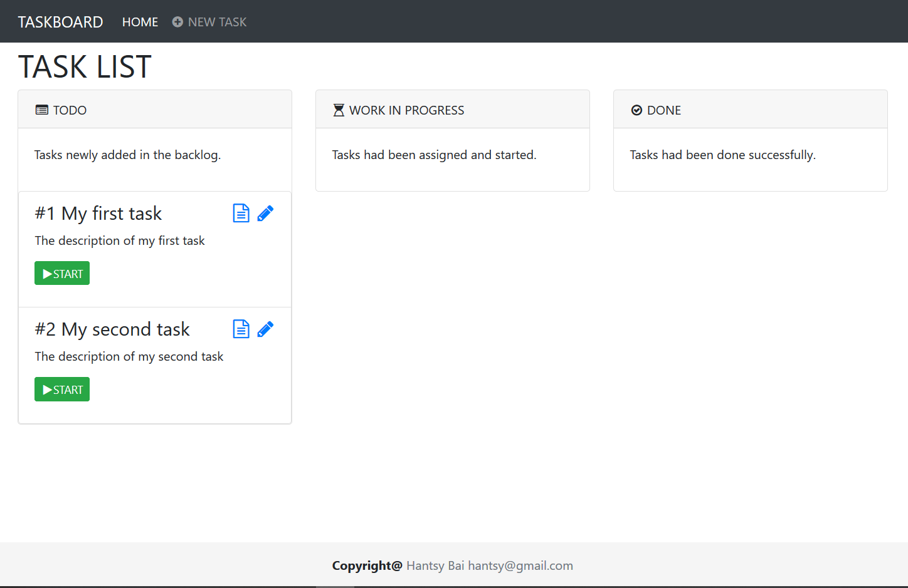

#  Jakarta EE Server Faces Sample


A Jakarta Server Faces sample application based on the [jakartaee8-starter](https://github.com/hantsy/jakartaee8-starter) boilerplate.



## Documentation

[Building a Jatarka Server Faces application](/docs/guide.md)

## Build

1. Clone a copy of the source codes.

   ```bash
   git clone https://github.com/hantsy/jakartaee-faces-sample
   ```

2. Run on Glassfish, Wildfly or Open Liberty.

   ```bash
   mvn clean package cargo:run -pglassfish-local
   mvn clean wildfly:run -Pwildfly
   mvn clean liberty:create dependency:copy liberty:run -Popenliberty
   ```
   
## Reference

* [Testing HTML and JSF-Based UIs with Arquillian](https://blogs.oracle.com/javamagazine/testing-html-and-jsf-based-uis-with-arquillian)
* [Functional Testing using Drone and Graphene](http://arquillian.org/guides/functional_testing_using_graphene/)
* [Arquillian Drone Reference Documentation](http://arquillian.org/arquillian-extension-drone)
* [Arquillian Graphene  Reference Documentation](http://arquillian.org/arquillian-graphene)
