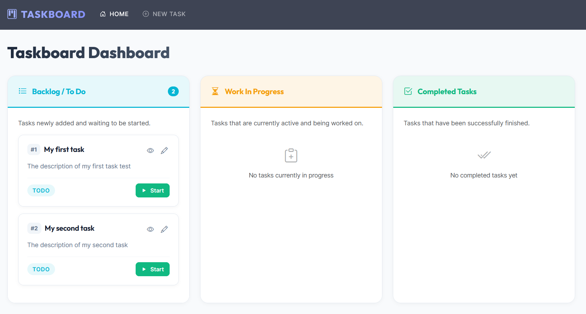

#  Jakarta EE Faces Sample

[](https://github.com/hantsy/jakartaee-faces-sample/actions/workflows/maven.yml)


A Jakarta Faces example application demonstrates the latest Jakarta EE tech stack for classic web application development.

The repository has already been upgraded to Jakarta EE 10.

* For the Jakarta EE 10 version with GlassFish v7.1 and Java 21, check the release [Archive for Jakarta EE 10 with GlassFish v7.1 and Java 21](https://github.com/hantsy/jakartaee-faces-sample/releases/tag/ee10-gf7-java21).
* For the Jakarta EE 10 version, check the release [Archive for Jakarta EE 10](https://github.com/hantsy/jakartaee-faces-sample/releases/tag/ee10).
* For the old Jakarta EE 8 version, check the release [Archive for Jakarta EE 8](https://github.com/hantsy/jakartaee-faces-sample/releases/tag/v1.0).
* For the legacy JavaEE 8 source codes, go to the repository [javaee8-jsf-sample](https://github.com/hantsy/javaee8-jsf-sample).



## Documentation

[Building a Jatarka Server Faces application](/docs/guide.md)

## Build

1. Clone a copy of the source code.

   ```bash
   git clone https://github.com/hantsy/jakartaee-faces-sample
   ```

2. Run on Glassfish.

   ```bash
   mvn clean package cargo:run -pglassfish
   ```

3. Run the test on the GlassFish managed adapter.

   ```bash
   mvn clean verify -Parg-glassfish-managed
   ```

 > [!WARNING]
 > To reduce maintenance costs, I have removed the configuration for running the applications on WildFly, OpenLiberty, Payara, etc. If you need to run it on these application servers, please refer to [jakartaee9-starter-boilerplate](https://github.com/hantsy/jakartaee9-starter-boilerplate) or  [jakartaee10-starter-boilerplate](https://github.com/hantsy/jakartaee10-starter-boilerplate) and add the configuration yourself.
   
## Reference

* [Testing HTML and JSF-Based UIs with Arquillian](https://blogs.oracle.com/javamagazine/testing-html-and-jsf-based-uis-with-arquillian)
* [Functional Testing using Drone and Graphene](http://arquillian.org/guides/functional_testing_using_graphene/)
* [Arquillian Drone Reference Documentation](http://arquillian.org/arquillian-extension-drone)
* [Arquillian Graphene  Reference Documentation](http://arquillian.org/arquillian-graphene)
